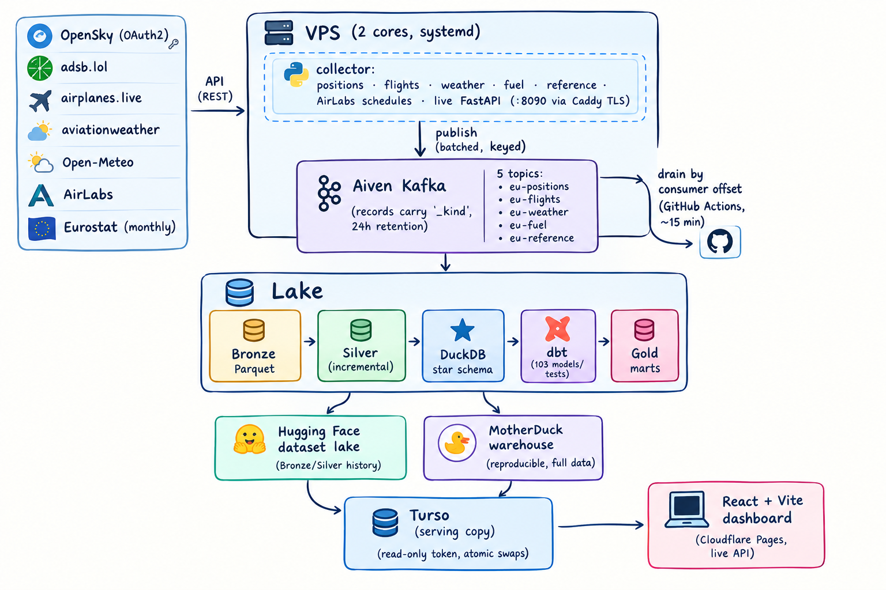

<p align="center">
  
</p>

# EU Air Traffic

<p align="center">
  
</p>

[](https://github.com/swadhinbiswas/eu-air-traffic/actions/workflows/ci.yml)
[](https://github.com/swadhinbiswas/eu-air-traffic/actions/workflows/lake.yml)
[](LICENSE)
[](https://doi.org/10.5281/zenodo.22790201)

Live dashboard: https://airtraffic-eu.pages.dev
· Live API: https://vps.swadhin.cv/health
· Data lake: https://huggingface.co/datasets/swadhinbiswas/air-traffic
· Demo video: coming soon

A real-time and historical view of European airspace, built as a pipeline rather
than a demo: live aircraft positions, weather, schedules, delays, emissions, and
official Eurostat passenger numbers sitting beside the movements this platform
counted itself. Provider request budgets and write budgets are enforced in code,
which is what keeps the numbers current without a human watching.

---

## What it does

| Layer | What you get |
|---|---|
| Live map | ~2,000 aircraft with callsign, type, altitude, speed, vertical rate, route lines, METAR/TAF stations, searchable by callsign/registration/type/airport |
| Live analytics | Airspace composition, altitude bands, operators, carbon intensity (OpenAP kinematic model, measured vs. estimated) |
| Business analysis | Delays, punctuality, cancellations, airport leaderboard, airline rankings, route performance, weather impact, seasonal trends |
| Official benchmark | Eurostat monthly passengers per airport cross-checked against the movements this platform observed |
| SQL workbench | Query the serving copy directly in the browser (read-only token) |
| Ops | Pipeline step report, data-quality report, dbt lineage, freshness |

## Architecture



A collector on a small VPS polls upstream APIs and publishes to a five-topic
Kafka cluster. Every 15 minutes a scheduled pipeline drains Kafka, builds
Bronze, Silver and DuckDB layers and dbt marts, then pushes to Hugging Face (the
dataset lake), MotherDuck (the full warehouse) and Turso (the copy the browser
is allowed to read). The dashboard reads Turso plus the collector's live API.
The serving copy is not tied to one database: `TURSO_TARGETS` spreads the tables
over several Turso databases — typically one per free-tier account — and a table
listed under more than one target is mirrored, so the browser fails over to
another copy when an account is down or out of quota.

### Why two serving stores

MotherDuck holds the full warehouse, but its user model cannot issue scoped
read-only tokens to a browser. Turso can, so the site reads a derived, bounded
copy there instead: small enough to hold cheaply, safe to expose, refreshed
every cycle. The dashboard's paging totals come from a precomputed
`site_summary` lookup, so browser polls never scan the fact tables.

Free-tier accounts also carry their own read/write budgets, so the serving copy
can span a small fleet. Tables named by several targets are mirrored (each copy
synced and versioned independently), the publisher keeps going when one target
fails instead of stalling the cycle, and the browser router fails over to a
healthy copy and stays there while the failed account cools down. No Turso
replication is involved — every target is an independent database.

The raw and curated lake behind all of this, Bronze windows plus the eleven
Silver snapshots, is published at
https://huggingface.co/datasets/swadhinbiswas/air-traffic (MIT):

```python
from datasets import load_dataset

flights = load_dataset(
    "swadhinbiswas/air-traffic", name="silver", split="flights"
)
print(flights[:2])
```

It is generated and documented in [`docs/huggingface-dataset.md`](docs/huggingface-dataset.md):
layout, scripts, cadence, and the dataset card.

## Constraints and the trade-offs behind them

| Constraint | Design response |
|---|---|
| Kafka: five topics per cluster | One topic per domain; weather (metar/taf/forecast) and reference data multiplex with a `_kind` discriminator the sink splits back into datasets |
| OpenSky: credit budgets per endpoint | `/flights/all` (one request, both ends) + live departures for 4 hubs + a nightly arrivals backfill; ~2.7k of 4k daily credits |
| AirLabs: 1,000 calls/month, 50 rows/call | Rotating hubs, persisted monthly counter that stops at the budget, IATA→ICAO resolved from bundled data (no extra calls) |
| Turso: row read/write budget | Dashboard aggregates are precomputed into a one-row `site_summary` lookup; statics upload only when a content hash changes and past a refresh floor; growing tables are watermark-synced; tables the site no longer needs are dropped from the serving copy; the copy is spread over several free-tier accounts (`TURSO_TARGETS`), with mirrored tables and browser-side failover |
| Object storage: storage and commit budget | Silver is partitioned per source; only changed files are pushed; unchanged files are recognised as no-ops |
| CI runners: shared and ephemeral | Frontend-only pushes skip the lake entirely, and the job fails fast instead of retrying silently |
| VPS: 2 cores | The box only collects; all transformation runs in CI |

## Data sources

- **OpenSky Network** — flight movements (OAuth2 client credentials; username/password is no longer accepted by OpenSky).
- **adsb.lol** — primary live positions; **airplanes.live** and **OpenSky** as fallbacks.
- **AirLabs** — live schedules with planned times and delays.
- **aviationweather.gov** (METAR/TAF) and **Open-Meteo** (forecast).
- **Eurostat `avia_paoa`** — official monthly passengers per airport (~2-month lag), fetched monthly by GitHub Actions and loaded as a benchmark layer.
- **OurAirports / OpenFlights / ICAO 8643** — reference data built once by `scripts/build_reference_data.py`.
- **OpenAP** (TU Delft) — kinematic fuel-flow model, precomputed into a 37-type lookup grid.

## Repository layout

```
├── services/            # VPS runtime: collector, sources, live API/store, Kafka bus, sink
│   └── sources/         #   one module per upstream data product
├── pipelines/           # silver (incremental), warehouse (star schema), quality, orchestrator
├── dbt/                 # staging → intermediate → marts → reports + tests
├── scripts/             # lake_sync, publish_{motherduck,turso,site_tables}, fetch_eurostat, …
├── web/                 # React + Vite dashboard (Turso + live API)
├── deploy/              # systemd unit, Caddyfile
├── docker/              # lake job image (runs the cycle anywhere)
└── tests/               # unit + e2e (pytest)
```

## Local development

```bash
uv sync --extra dev --extra stream --extra turso
cp .env.example .env                      # fill in what you have; several sources work keyless
uv run pytest                             # 120+ tests
uv run python -m services.collector       # optional: run the collector + live API
cd web && npm ci && npm run dev           # dashboard (web/.env.local for VITE_* values)
```

Run the pipeline locally without Kafka:

```bash
MOCK_MODE=true uv run python -m pipelines.orchestrator
AIR_TRAFFIC_DUCKDB_PATH=$PWD/warehouse/air_traffic.duckdb uv run dbt build --project-dir dbt --profiles-dir dbt
```

## Configuration (`.env`)

| Variable | Purpose |
|---|---|
| `AIVEN_KAFKA_HOST/PORT/USERNAME/PASSWORD/CA_CERT` | Kafka (SASL_SSL) |
| `OPENSKY_CLIENT_ID` / `OPENSKY_CLIENT_SECRET` | OpenSky OAuth2 (required) |
| `AIRLABS_API_KEY` | Schedules; the source is skipped without it |
| `HF_TOKEN`, `HF_REPO` | Dataset lake |
| `MOTHERDUCK_TOKEN`, `MOTHERDUCK_DATABASE` | Warehouse |
| `TURSO_TARGETS` | JSON array of `{name,url,token,tables}` serving databases; a table listed in several targets is mirrored for read failover (publisher uses the read-write tokens) |
| `TURSO_DATABASE_URL`, `TURSO_AUTH_TOKEN` | Legacy single serving database, used only when `TURSO_TARGETS` is empty |
| `VITE_LIVE_URL`, `VITE_TURSO_URL_n`, `VITE_TURSO_TOKEN_n`, `VITE_TURSO_TARGETS` | Dashboard build-time values; every Turso token must be read-only |

Sane defaults, override only if needed: `POSITIONS_INTERVAL_SECONDS=15`,
`POSITIONS_PUBLISH_INTERVAL_SECONDS=300`, `FLIGHTS_INTERVAL_SECONDS=1800`,
`FLIGHTS_LOOKBACK_MINUTES=90`, `FLIGHTS_ARRIVAL_INTERVAL_SECONDS=21600`,
`AIRLABS_HUBS_PER_CYCLE=4`, `AIRLABS_MONTHLY_BUDGET=800`, `LAKE_WINDOW_SECONDS=420`.

## Deployment

- **Collector (VPS):** `deploy/eu-collector.service` + `deploy/Caddyfile`
  (TLS termination, gzip, binding the API to `127.0.0.1`).
- **Lake (GitHub Actions):** `.github/workflows/lake.yml` — every 15 minutes and
  on data/pipeline pushes; drains Kafka, builds Silver, runs dbt, publishes to
  Hugging Face, MotherDuck and Turso.
- **Eurostat benchmark:** `.github/workflows/eurostat.yml`, monthly.
- **Reliable cadence:** GitHub's scheduler is best-effort. `deploy/eu-lake-dispatch.{service,timer}`
  dispatches the lake from the VPS every 15 minutes (skipping when one is already
  queued), so data keeps arriving even when `schedule` runs late.
- **Dashboard:** `.github/workflows/bundle.yml` + Cloudflare Pages Git integration.
  Set the `VITE_*` values in Pages → Settings → Variables and secrets (Production).
  They are inlined at build time, so a changed value only takes effect after a new
  deployment (Deployments → Retry deployment, a deploy hook, or a push to `main`).
- **Anywhere else:** `docker/lake-job.Dockerfile` + `scripts/run_lake.sh` runs one
  full cycle in a container (set `HF_SYNC=0` when the dataset is mounted).

### Deploy with Docker (one command)

```bash
cp .env.example .env      # fill in your credentials
./deploy.sh               # collector + lake; add --tls to put Caddy in front
```

`docker-compose.yml` wires the collector (live API on `:8090`, healthchecked),
the lake cycle on a timer — sharing the same `.env` and DuckDB state — and an
optional Caddy TLS front via `SITE_ADDRESS`. `./deploy.sh --logs`, `--ps` and
`--down` manage the stack. No local Kafka is needed: point `.env` at Aiven (or
any broker) and the containers connect out.

## Running it at scale

This repository ships as one collector, one scheduled batch job and two serving
stores. The seams are already in the right places for something larger: each
source is an independent module behind a single interface, Kafka decouples
collection from processing, the lake is plain Parquet, dbt owns the
transformations, and the site reads a derived copy that can be rebuilt from the
warehouse at any time.

The right column is the migration path this codebase is shaped for, not what is
running today. What this repository deploys is the left column, and the
container path under `docker/` is the one that has been exercised end to end.

| Part | Here | Production swap |
|---|---|---|
| Collection | one process on a small host, systemd | several collectors in a consumer group, one deployment per source class, scaling by partition |
| Event bus | managed Kafka, five topics, 24 h retention | more partitions, longer or tiered retention, a schema registry, dead-letter topics |
| Lake | Hugging Face dataset, Parquet | S3, R2 or GCS with Iceberg or Delta tables, partitioned by date and entity, compaction on a schedule |
| Transformation | GitHub Actions, 15-minute schedule | Airflow, Dagster, Prefect or Argo Workflows, with retries, backfills, SLAs and lineage |
| Warehouse | MotherDuck, dbt on DuckDB | Snowflake, BigQuery, ClickHouse or Postgres, dbt incremental models with a unique key |
| Serving | Turso read-only copy | Postgres read replica, ClickHouse, or a cache in front of the API, keeping the read-only credential model |
| Dashboard | Cloudflare Pages | the same, plus preview deployments per pull request |
| Secrets | `.env` on the host | Vault, AWS Secrets Manager or SOPS with External Secrets, scoped per workload |
| Observability | `/health` and logs | Prometheus and Grafana, OpenTelemetry traces, per-source freshness and lag alerts |
| Infrastructure | systemd and Docker Compose | Terraform or Pulumi for resources, Helm for workloads, a staging environment per change |

### Growing the collector

Run each source as its own workload so a slow or rate-limited upstream cannot
delay the rest. That is already why they have separate intervals. Give topics
more partitions than consumers and key records by `icao24` or `flight_id`, so
per-aircraft ordering holds as throughput grows. Move cooldowns, watermarks and
rate-limit counters out of process memory into Redis or Postgres, and keep
provider limits in configuration. The budget guard in the AirLabs source is the
pattern to copy: a persisted counter that stops at a cap instead of hoping the
schedule holds.

### Growing the lake

Partition Bronze by ingestion time and Silver by entity and date, then compact
small files on a schedule, which is the first thing that hurts at volume.
Replace snapshot replacement with a merge on a primary key: an Iceberg or Delta
`MERGE`, or a dbt incremental model with `unique_key`. Every table here is
written through one helper, so that change lands in one place. Keep the data
rules that make the numbers trustworthy: deduplicate across providers, keep
unknown values NULL, and never let a publish report success without writing.
Backfills come from Kafka while retention allows, then from Bronze, and every
transform must be safe to run twice.

### Growing the serving layer

Publish atomically. The shadow-table swap used for Turso maps directly onto an
Iceberg commit or a Postgres transaction. Cache at the edge with ETag and 304
handling, serve a slim payload to the polling endpoint, and keep hashed assets
immutable. Put limits on anything a visitor can trigger: row and time limits on
SQL, rate limits per address, and a credential that cannot write.

### Operating it

Alert on data freshness per source, not only on process liveness, since the
quality report already computes what is stale. Keep runbooks for the failures
this project has already met: upstream 401, 403 and 429 responses, Kafka lag, a
rejected warehouse publish, and quarantine review. Enforce budgets in code and
check them on a schedule; the guard that stops an API at its monthly cap works
the same way as a spend guard. Test the failure paths, because that is where
almost all of the interesting behaviour lives.

### A deployment order that works

1. Provision the services: object storage, Kafka, the warehouse, the serving
   database and a secret store.
2. Build both images, `docker/Dockerfile.collector` and
   `docker/lake-job.Dockerfile`.
3. Deploy the collector, then confirm `/health` and that topic offsets advance.
4. Run one lake cycle by hand and confirm Silver, dbt and the serving copy.
5. Point the dashboard at the live API and the serving copy, then check the
   analytics pages against the warehouse.
6. Add freshness and lag monitoring before adding replicas.
7. Scale the collector and the lake workers independently, since Kafka is the
   only thing they share.

## Reliability engineering: what broke and what changed

This pipeline runs unattended, and most of the work went into failure handling
rather than the happy path. Each item below has a test:

- **Silent success.** Steps logged an error and exited 0 (an HF upload rejected
  by a trailing space in a configured repo id; a Turso publish that never
  wrote). Failures are now loud, and credentials that are set but empty raise.
- **Fresh-boot assumptions.** A publish cadence compared `monotonic()` against
  `0.0`, which only works when system uptime exceeds the interval. Missing
  state now means "due".
- **Destructive retries.** A failed lake pull could push a single window over
  the full Silver history; publishers could wipe serving tables mid-run. Pulls
  fail the job, and static tables load into a shadow table and swap atomically.
- **Double counting.** OpenSky movements and AirLabs schedules describe the same
  flight with different ids; marts dedupe on callsign + date + endpoint and
  only average delays that are actually known.
- **Timezone traps.** Casting `TIMESTAMPTZ` to `TIMESTAMP` shifts by the session
  offset, silently re-reading old rows and skipping boundary ones.
- **Queue starvation.** Every push entered one single-writer concurrency group
  until frontend-only pushes were excluded and the cadence was widened.

## Tests

```bash
uv run pytest -q                                    # unit + integration paths
uv run dbt build --project-dir dbt --profiles-dir dbt   # 103 models and tests
cd web && npm run build                              # type-check + production build
```

## Citation

The software is archived on Zenodo. Cite the version you used, which for this
release is v0.1.0:

- Version DOI: https://doi.org/10.5281/zenodo.22790202
- Concept DOI, always the latest version: https://doi.org/10.5281/zenodo.22790201

`CITATION.cff` carries the machine-readable form, and `paper/` holds the JOSS
manuscript draft.

## License

MIT — see [LICENSE](LICENSE).
