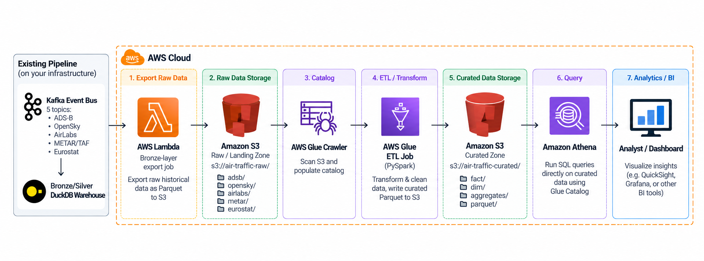

# The AWS version — serverless lakehouse



This is the AWS version of EU Air Traffic. It keeps the existing collector and
Kafka bus where they are and adds an **AWS analytics plane** on top: raw data is
landed in S3, catalogued by Glue, cleaned by a Glue PySpark job, and queried with
Athena by whatever BI tool you like. It is a different trade-off from the
fully-managed migration in [`aws-deployment.md`](aws-deployment.md) — this one is
fully serverless and mostly pay-per-query, that one runs always-on compute. The
README's AWS section explains when to pick which.

> **Reference implementation, not the live system.** These resources are not
> currently provisioned; the running deployment is the free-tier stack. The code
> is here so the same data can be analysed at scale without a rewrite.

---

## The seven stages

| # | Stage | AWS service | What it does here |
|---|---|---|---|
| 1 | Export raw data | **AWS Lambda** | Reads the existing lake (S3 or Hugging Face) and lands raw Parquet in the landing zone. `aws/lambda/bronze_export/handler.py` |
| 2 | Raw data storage | **Amazon S3** | Landing zone, `adsb/`, `opensky/`, `airlabs/`, `metar/`, `eurostat/`, one partition per day. |
| 3 | Catalog | **AWS Glue Crawler** | Scans the raw prefixes and registers the tables and partitions in the Glue Data Catalog. |
| 4 | ETL / transform | **AWS Glue (PySpark)** | Cleans, types, and deduplicates; writes curated Parquet. `aws/glue/etl_job.py` |
| 5 | Curated data storage | **Amazon S3** | Curated zone, `fact/`, `dim/`, `aggregates/`, `parquet/`. |
| 6 | Query | **Amazon Athena** | SQL straight over the curated Parquet through the catalog. `aws/athena/ddl/*.sql` |
| 7 | Analytics / BI | **QuickSight / Grafana** | Dashboards and the cross-check against Eurostat. `aws/athena/queries.sql` |

The pipeline is deliberately split at S3: stages 1–2 are the only ones that
touch the existing system, and everything from stage 3 on is a pure Redshift of
the raw zone. **Both the raw and the curated zones are derived** — the curated
zone can be rebuilt from raw, and raw from the lake, so a mistake at any stage is
a re-run, not a data loss.

---

## What you need first

- An AWS account, and the AWS CLI configured (`aws sts get-caller-identity`).
- Terraform ≥ 1.10 (`infra/terraform-serverless/`).
- The existing pipeline producing data — see the main README. For a first run,
  `MOCK_MODE=true` is enough; the Lambda will export synthetic records and the
  whole chain still exercises end to end.

---

## Build it

Every command below is what the video walks through.

### 1. Provision the stack

```bash
cd infra/terraform-serverless
cp terraform.tfvars.example terraform.tfvars   # set bucket names / region if you like
terraform init
terraform plan
terraform apply
```

This creates the two buckets (raw and curated), the Lambda and its schedule, the
crawler, the Glue job and its trigger, the Athena workgroup, and the IAM roles.
See [`../infra/terraform-serverless/README.md`](../infra/terraform-serverless/README.md)
for the full resource list.

### 2. Land the raw data

The Lambda is on an EventBridge schedule (default hourly), so it starts filling
the raw zone on its own. To see it immediately:

```bash
aws lambda invoke \
  --function-name "$(terraform output -raw bronze_export_function_name)" \
  --payload '{}' /tmp/export.json && cat /tmp/export.json

aws s3 ls --recursive "s3://$(terraform output -raw raw_bucket_name)/" | head
```

You should see `adsb/dt=.../`, `opensky/dt=.../`, and so on. The landing zone is
append-only: a second run adds objects, it never rewrites a day.

### 3. Catalogue it

```bash
aws glue start-crawler --name "$(terraform output -raw crawler_name)"
aws glue get-crawler --name "$(terraform output -raw crawler_name)" \
  --query 'Crawler.State'
# wait for READY, then:
aws glue get-tables --database-name "$(terraform output -raw raw_database_name)" \
  --query 'TableList[].Name'
```

### 4. Transform it

```bash
aws glue start-job-run --job-name "$(terraform output -raw glue_job_name)"
aws glue get-job-runs --job-name "$(terraform output -raw glue_job_name)" \
  --query 'JobRuns[0].[JobRunState,ErrorMessage]'
```

The job reads the raw tables, deduplicates on the pipeline's business keys,
writes Parquet to the curated prefixes, and updates the catalog. The daily
trigger runs this automatically after the crawler.

### 5. Query it

```bash
aws athena start-query-execution \
  --work-group "$(terraform output -raw athena_workgroup_name)" \
  --query-string "SELECT date, count(*) AS flights FROM eu_air_traffic_curated.fact_flights GROUP BY date ORDER BY date DESC LIMIT 10" \
  --result-configuration OutputLocation="s3://$(terraform output -raw curated_bucket_name)/athena-results/"
```

Or open the Athena console, pick the workgroup, and run the queries in
[`aws/athena/queries.sql`](../aws/athena/queries.sql) — daily traffic, busiest
airports, punctuality, weather impact, and the Eurostat cross-check.

### 6. Point BI at it

Create a QuickSight dataset (or a Grafana Athena data source) on the
`eu_air_traffic_curated` database. QuickSight talks Athena, Athena talks the
Glue Catalog, and the catalog points at S3 — no data moves.

---

## How it maps onto the repository

| Repository artefact | Role in the AWS version |
|---|---|
| `services/collector.py`, Kafka topics | Unchanged — the "existing pipeline" on the left of the diagram |
| `services/lake_backend.py` | The Lambda reads the same lake; `LAKE_BACKEND=s3` puts it on S3 |
| `aws/lambda/bronze_export/handler.py` | Stage 1 export |
| `aws/glue/etl_job.py` | Stage 4 transform — same dedupe keys as `pipelines/silver.py` |
| `aws/athena/` | Stage 6/7 DDL and queries |
| `infra/terraform-serverless/` | All of the above, as code |
| `dbt/`, `pipelines/warehouse.py` | The equivalent transform on the free path; the Glue job is its serverless counterpart |

---

## Cost

The point of this design is that idle costs almost nothing:

- **S3** dominates the baseline — raw + curated Parquet, partitioned and lifecycled
  to STANDARD_IA/Glacier, typically a few dollars a month.
- **Lambda** runs for a few seconds an hour; effectively free.
- **Glue** bills in DPU-hours while the job runs; a small job on a daily trigger
  is cents to low dollars a month.
- **Athena** bills per TB scanned. Partitioning by date is what keeps it cheap:
  a dashboard that filters on `date` reads a few partitions, not the lake.
- **QuickSight** is the one fixed monthly cost, and it is per author.

Turning the schedule down (or off) drops everything but S3 storage to zero.

---

## Verifying it worked

1. `aws s3 ls -r s3://<raw-bucket>/` shows all five domains with `dt=` partitions.
2. The crawler reports the raw tables; `aws glue get-tables` lists them.
3. The Glue job's last run is `SUCCEEDED`.
4. `s3://<curated-bucket>/curated/fact/fact_flights/` has `date=` partitions.
5. The Athena query returns rows and the workgroup's "data scanned" is small.
6. The QuickSight dataset refreshes and the daily-traffic visual matches.
7. Breaking something on purpose (empty raw partition) fails the Glue job loudly
   rather than publishing a partial day — the same "no silent success" rule as
   the main pipeline.

---

## Why this shape

The main pipeline is built so its layers can be swapped independently (see
"Running it at scale" in the README). This is that promise cashed in for
analytics: the collector and Kafka are untouched, the lake becomes an S3 landing
zone instead of a dataset repo, and the transform moves from dbt-on-DuckDB to
Glue-on-PySpark. Because the raw zone is append-only and the curated zone is
derived, the AWS plane can be added, rebuilt, or removed without ever touching
the system that is actually collecting aircraft.
